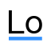

<h1 align="center" style="border-bottom: none;">Hi , I'm Younes!</h1>

- 💻 Heya! I'm a **front-end web developer** based in the Philippines with almost a year of experience in developing websites. I'm always tinkering with side projects to improve my skills and if you have an open-source project or would like to collaborate, I'd love to hear from you! Don't hesitate to reach out and connect.
- 📝 Planning to write more articles on [hashnode](https://hashnode.com/@Finestwork).

- 🎮 Let us solve code challenges on [codewards](https://www.codewars.com/users/Finestwork), [leetcode](https://leetcode.com/Finestwork/), [HackerEarth](https://www.hackerearth.com/@finestwork), [codechef](https://www.codechef.com/users/finestwork).

- 📫 You can reach me in [LinkedIn](https://www.linkedin.com/in/younes-espiritu-a32a16269/), [discord](https://discord.com/users/431340211952418827), [email](mailto:kapitan.heneral.dev@outlook.com).

&nbsp;
## Languages & Frameworks
<!--📏LINE-->

<a href="https://getbootstrap.com/" target="_blank"><a/>

&nbsp;

## Visual Design & Prototyping Softwares
<!--📏LINE-->

&nbsp;
<!--📏LINE-->

